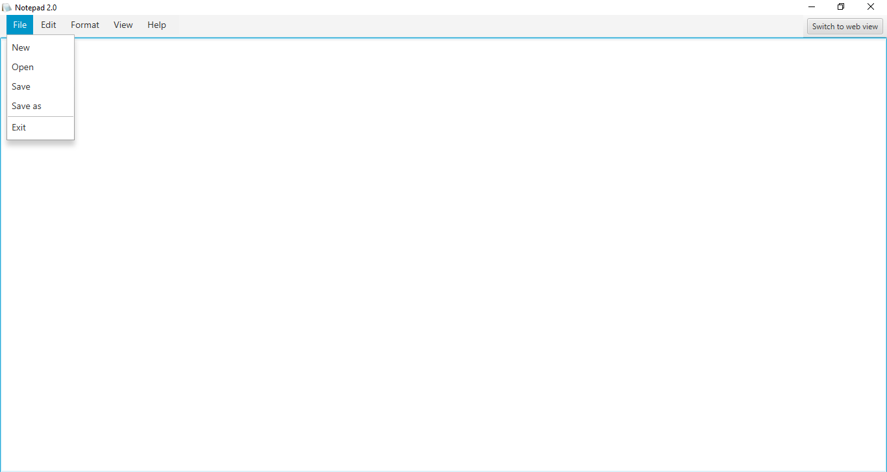

# Notepad 2.0 :wave:

 This is a simple notepad application created in Java using JavaFx-11. 

 

### Features
<ul>
    <li>Create a new file.
    <li>Edit an existing file.
    <li>Select font family,color and size
    <li>Web Search Handle
    <li>Feedback form
    <li>Common features- Find and Replace,Cut,Copy,Paste,Undo,Redo...
    <li>Other features- Screen Lock,Casing,Ordering...
    <li>WEB version of Notepad 2.0 (Newly added)
</ul>

---

## screenshots

### Main View

 

### File Options

 

### Edit Options

 

### Format Options

 

### Format -> Font Options

 

### Format -> Styling Options

 

### View Options

 

### View -> Zoom Options

 

### View -> Screen Setup Options

### Help Options

---

# WEB VIEW
